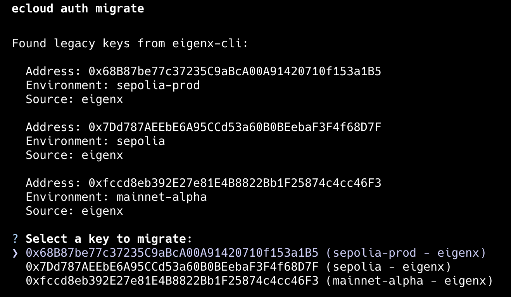
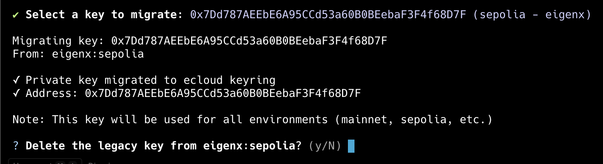
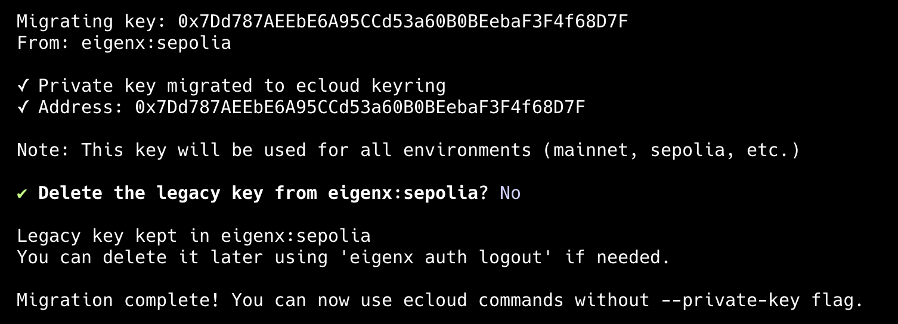

## Migration Guide: Eigenx to Ecloud

This guide explains how to migrate from [eigenx](https://github.com/Layr-Labs/eigenx-cli) to the `ecloud` CLI for managing your EigenCompute application.

### Installing the Ecloud CLI

```bash
npm install -g @layr-labs/ecloud-cli
```

To verify that the installation was successful, run:

```bash
ecloud version
```

You should see output similar to the following:

```bash
Version: 0.0.1-dev.1
Commit:  be757436b79faff7959b8375dbb051cc47cb0895
```

### Migrating auth key from Eigenx
> [!NOTE]
> For simplicity, the `ecloud` CLI only supports storing one key for all environments. To use a different key, you can use the `--private-key` flag or set the `ECLOUD_PRIVATE_KEY` environment variable.
Run the migrate command:

```bash
ecloud auth migrate
```

You should see output similar to the following:



Use the up/down arrow keys to select the wallet you want to migrate.


After selecting the key you want to migrate, you should see something like this:



> [!NOTE]
> We recommend keeping your eigenx keys intact and not deleting them until you have verified that the migrated key work correctly.

Once the migration is complete, you will see a message like this:



### Verifying the Migration

Run the following command to view the migrated key:

```bash
ecloud auth whoami
```

You should see output similar to the following:

```
Address: 0x7Dd787AEEbE6A95CCd53a60B0BEebaF3F4f68D7F
Source:  stored credentials

Note: This key is used for all environments (mainnet, sepolia, etc.)
```