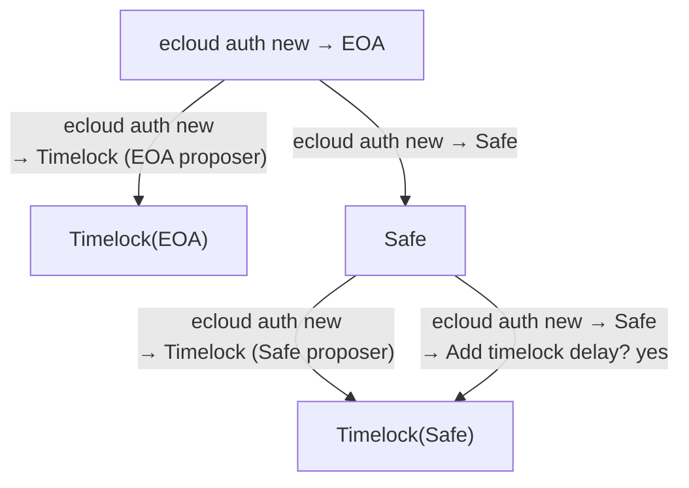
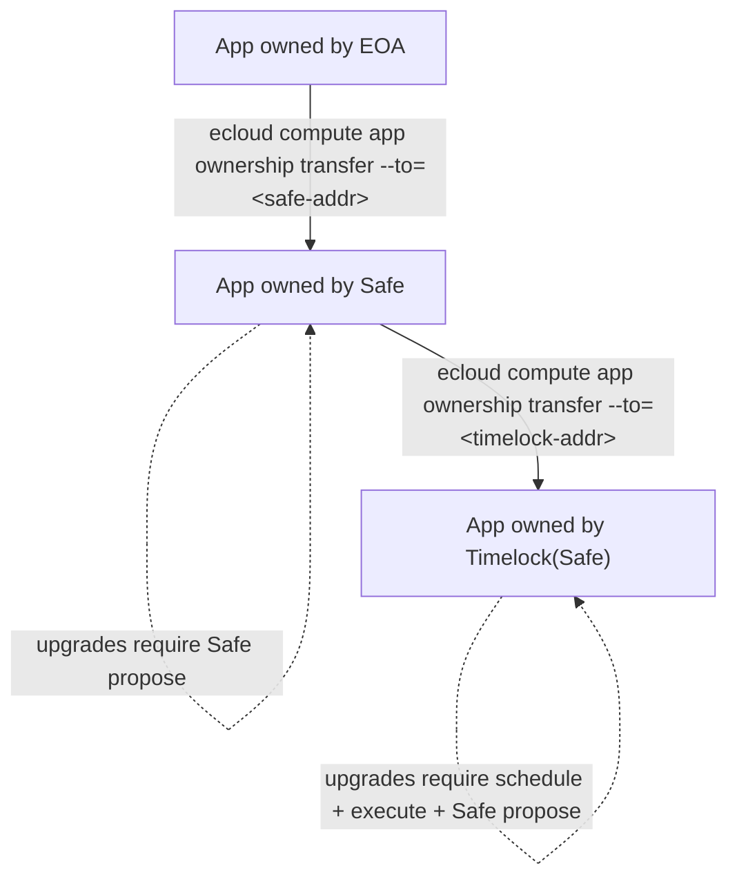

# Identity × Command Matrix

## Running the demo

The CLI ships with a stateful demo mode that simulates all governance flows without hitting real contracts.

**Setup:**
```bash
# from the ecloud repo root
alias ecloud="node packages/cli/bin/run.js"

cd packages/cli && npm run build
```

**Start demo mode** (no flags needed — demo is active by default):
```bash
ecloud auth login
```

Demo state is stored in `/tmp/ecloud-demo-state.json` and persists across commands. To reset:
```bash
rm /tmp/ecloud-demo-state.json
```

---

Behaviour of each CLI command per identity type.

**Identity types:**
- **EOA** — plain wallet, signs directly
- **Timelock(EOA)** — Timelock contract with an EOA as proposer/executor
- **Safe** — Gnosis Safe (multi-sig threshold)
- **Timelock(Safe)** — Timelock contract with a Safe as proposer/executor
- **PAUSER** — EOA (or Safe) granted PAUSER role by an ADMIN; can stop apps only
- **DEVELOPER** — EOA granted DEVELOPER role by an ADMIN; read-only + metadata ops

## Identity migration

How accounts can be created and upgraded to stronger security models.



**App ownership migration** — transfer the app to a stronger owner:



**Upgrade behaviour changes with each step:**

| App owner | Upgrade command | Flow |
|---|---|---|
| EOA | `ecloud compute app upgrade` | direct |
| Safe | `ecloud compute app upgrade` | Safe propose → approved |
| Timelock(Safe) | `ecloud compute app upgrade schedule` + `execute` | Safe propose → delay → Safe propose |

---

**Column abbreviations:** `TL(EOA)` = Timelock with EOA proposer · `TL(Safe)` = Timelock with Safe proposer

**Legend:**
- `direct` — CLI signs and submits immediately, no extra steps
- `direct (after delay)` — CLI signs and submits; delay must have elapsed since `schedule`
- `Safe propose` — CLI proposes tx to Safe; threshold of signers must approve at app.safe.global
- `Safe propose (after delay)` — same as `Safe propose`, but delay must have elapsed since `schedule`
- `no permission` — command is blocked; CLI shows a descriptive error with the correct alternative
- `yes` — available / shown
- `—` — not applicable / not shown

---

## Auth

| Command | EOA | TL(EOA) | Safe | TL(Safe) | PAUSER | DEVELOPER |
|---|---|---|---|---|---|---|
| `ecloud auth login` | select identity | select identity | select identity | select identity | select identity | select identity |
| `ecloud auth new` | create EOA key | create Timelock | create Safe | create Timelock | — | — |

---

## compute app

| Command | EOA | TL(EOA) | Safe | TL(Safe) | PAUSER | DEVELOPER |
|---|---|---|---|---|---|---|
| `deploy` | direct | direct | Safe propose | Safe propose | no permission | no permission |
| `upgrade` | direct | no permission | Safe propose | no permission | no permission | no permission |
| `start` | direct | direct | Safe propose | Safe propose | no permission | no permission |
| `stop` | direct | direct | Safe propose | Safe propose | direct | no permission |
| `terminate` | direct | direct | Safe propose | Safe propose | no permission | no permission |
| `terminate schedule` | no permission | direct | no permission | Safe propose | no permission | no permission |
| `terminate execute` | no permission | direct (after delay) | no permission | Safe propose (after delay) | no permission | no permission |

---

## compute app metadata & observability

| Command | EOA | TL(EOA) | Safe | TL(Safe) | PAUSER | DEVELOPER |
|---|---|---|---|---|---|---|
| `profile set` | direct | direct | direct | direct | no permission | direct |
| `info` | yes | yes | yes | yes | yes | yes |
| `logs` | yes | yes | yes | yes | yes | yes |
| `list` | yes | yes | yes | yes | yes | yes |
| `releases` | yes | yes | yes | yes | yes | yes |

---

## compute app upgrade

Only available when identity is `TL(EOA)` or `TL(Safe)`. Blocked for all other identities.

| Command | EOA | TL(EOA) | Safe | TL(Safe) | PAUSER | DEVELOPER |
|---|---|---|---|---|---|---|
| `upgrade schedule` | no permission | direct | no permission | Safe propose | no permission | no permission |
| `upgrade execute` | no permission | direct (after delay) | no permission | Safe propose (after delay) | no permission | no permission |
| `upgrade cancel` | no permission | direct | no permission | Safe propose | no permission | no permission |
| `demo fastforward` | — | skips delay | — | skips delay | — | — |

---

## compute app ownership

| Command | EOA | TL(EOA) | Safe | TL(Safe) | PAUSER | DEVELOPER |
|---|---|---|---|---|---|---|
| `ownership transfer` | direct | direct | Safe propose | Safe propose | no permission | no permission |
| `ownership schedule-transfer` | no permission | direct | no permission | Safe propose | no permission | no permission |
| `ownership execute-transfer` | no permission | direct (after delay) | no permission | Safe propose (after delay) | no permission | no permission |

> Transferring to a Timelock address automatically enables timelocked mode on the app.
> `schedule-transfer` / `execute-transfer` are only available when the app is already timelocked.

---

## compute team

| Command | EOA | TL(EOA) | Safe | TL(Safe) | PAUSER | DEVELOPER |
|---|---|---|---|---|---|---|
| `team grant` (PAUSER/DEVELOPER) | direct | direct | Safe propose | Safe propose | no permission | no permission |
| `team revoke` (PAUSER/DEVELOPER) | direct | direct | Safe propose | Safe propose | no permission | no permission |
| `team list` | — | — | visible | visible | — | — |
| `team grant-admin schedule` | no permission | no permission | no permission | Safe propose | no permission | no permission |
| `team grant-admin execute` | no permission | no permission | no permission | Safe propose (after delay) | no permission | no permission |

> Team roles (ADMIN, PAUSER, DEVELOPER) are only shown in `ecloud compute app info` and `ecloud compute team list` when the app owner is a Safe or Timelock(Safe).
> ADMIN is the Safe or Timelock address — never an individual EOA in a Safe-governed app.

#### Why you should never grant ADMIN to an EOA in a Safe-governed app

AppController's admin check is purely role-based: it verifies `msg.sender` holds `keccak256(owner, ADMIN)`. It does **not** enforce that the caller went through Safe's threshold signing.

This means: if you grant ADMIN to an EOA, that EOA can call `upgradeApp`, `terminateApp`, `startApp`, etc. **directly** — bypassing the Safe entirely. The entire point of Safe ownership (threshold approval, no single point of failure) is defeated.

**The correct model for Safe-owned apps:**

| Role | Holder | How ops are authorized |
|---|---|---|
| ADMIN | Safe (or Timelock) only | Requires Safe threshold signature |
| PAUSER | Individual EOA | Direct — intentional, for emergency stop without delay |
| DEVELOPER | Individual EOA | Direct — limited to metadata and observability |

The contract does not hard-enforce this convention today — it is an operational rule. Granting ADMIN to an EOA is technically possible but breaks the security model. Since granting any role requires being ADMIN, and Safe is the sole ADMIN, any such grant would itself require Safe approval — making it a deliberate, visible act rather than an accident.

---

## compute app info

| Field shown | EOA | TL(EOA) | Safe | TL(Safe) | PAUSER | DEVELOPER |
|---|---|---|---|---|---|---|
| Owner | yes | yes (delay label) | yes | yes (delay + Safe label) | yes | yes |
| Status / Image / Instance | yes | yes | yes | yes | yes | yes |
| Team Roles section | — | — | yes | yes | — | — |

---

## Full upgrade flows by identity

### EOA
```
ecloud compute app deploy --image-ref myrepo/myapp:v1
ecloud compute app upgrade --image-ref myrepo/myapp:v2
```

### Timelock(EOA)
```
ecloud compute app deploy --image-ref myrepo/myapp:v1
ecloud compute app upgrade schedule <app-id> --after=24h
# wait for delay (or: ecloud demo fastforward)
ecloud compute app upgrade execute <app-id>
```

### Safe
```
ecloud compute app deploy          → Safe propose → approved → done
ecloud compute app upgrade         → Safe propose → approved → done
ecloud compute team grant <addr>   → Safe propose → approved → done
ecloud compute app stop            → Safe propose → approved → done
```

### Timelock(Safe)
```
ecloud compute app deploy                              → Safe propose → approved → done
ecloud compute app upgrade schedule <app-id> --after=24h → Safe propose → approved → scheduled
# wait for delay (or: ecloud demo fastforward)
ecloud compute app upgrade execute <app-id>            → Safe propose → approved → done
ecloud compute team grant <addr>                       → Safe propose → approved → done
ecloud compute app stop                                → Safe propose → approved → done
```

### Safe → Timelock(Safe) transition (adding upgrade delay)
```
# 1. Start as Safe, deploy the app
ecloud auth login                              → select 3/5 Safe
ecloud compute app deploy --image-ref myrepo/myapp:v1
                                               → Safe propose → approved → done

# 2. Transfer ownership to a Timelock (adds upgrade delay on top of Safe)
ecloud compute app ownership transfer --to=<timelock-addr>
                                               → Safe propose → approved → done
                                               → Timelocked mode enabled

# 3. Switch identity to the Timelock
ecloud auth login                              → select Timelock (24h delay) via 2/3 Safe

# 4. Direct upgrade is now blocked
ecloud compute app upgrade                     → ❌ TimelockRequired
                                               →   use: ecloud compute app upgrade schedule <app-id> --after=<delay>
                                               →         ecloud compute app upgrade execute  <app-id>

# 5. Use the two-step timelocked flow
ecloud compute app upgrade schedule <app-id> --after=24h
                                               → Safe propose → approved → scheduled
# wait for delay (or: ecloud demo fastforward)
ecloud compute app upgrade execute <app-id>    → Safe propose → approved → done
```

---

### PAUSER role (granted by Safe)
```
# Admin grants PAUSER role to 0x5678...
ecloud compute team grant 0x5678567856785678567856785678567856785678 → Safe propose → approved → done

# PAUSER acts directly, no Safe needed
ecloud auth login                   → select PAUSER identity (0x5678...5678)
ecloud compute app stop             → direct
```

### DEVELOPER role (granted by Admin)
```
# Admin grants DEVELOPER role to 0x9999...
ecloud compute team grant 0x9999... → (direct | Safe propose) → done

# DEVELOPER can view info, update metadata, view logs; cannot perform admin ops
ecloud auth login                   → select DEVELOPER identity (0x9999...)
ecloud compute app info             → shows status, image, instance type
ecloud compute app logs             → stream app logs
ecloud compute app profile set      → update name, website, description, image
ecloud compute app upgrade          → ❌ no permission
ecloud compute app stop             → ❌ no permission
```
